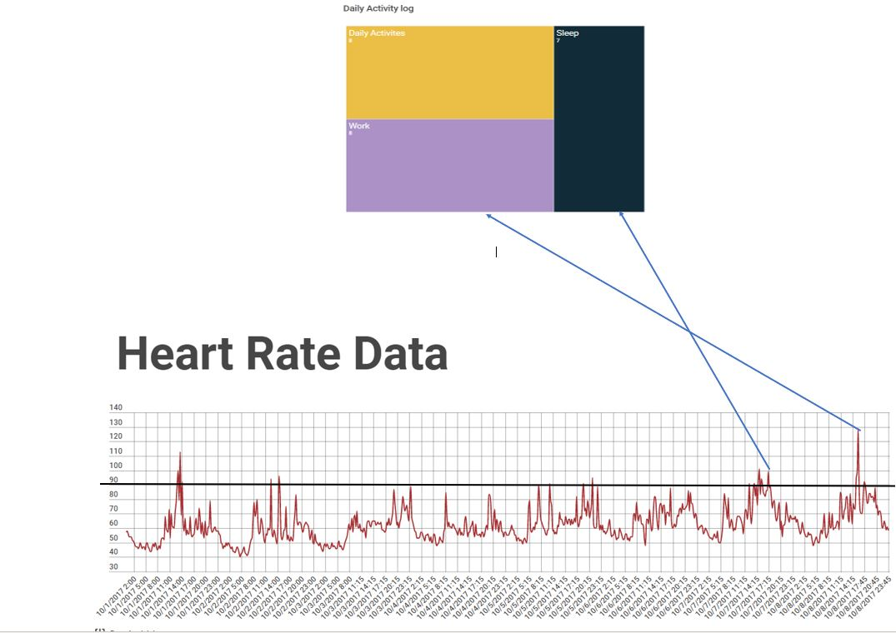
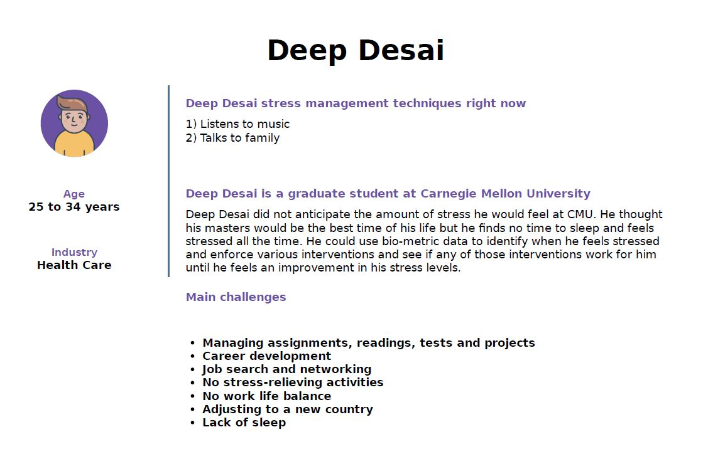
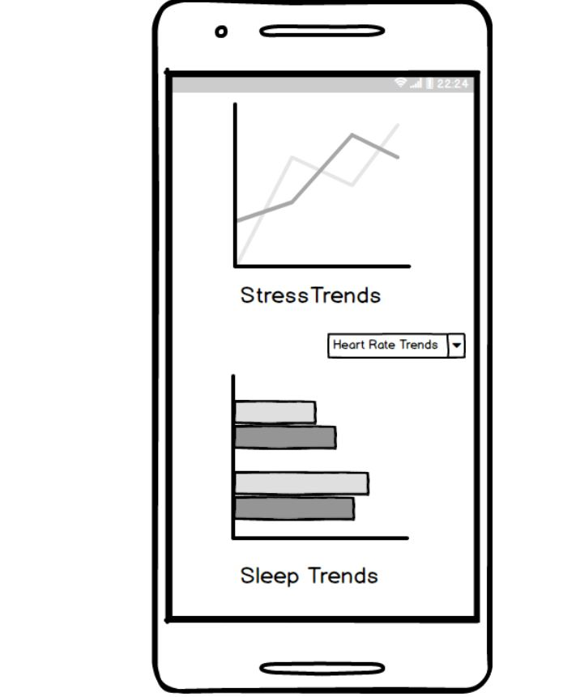

 # Final project 
  
 In a world where we use fitbit's and apple watches, using biometric data coupled with a daily activity log and a mood metric indicator can go a long way in helping us deal with stress. 
  
In my project I aim to use heart rate spikes, correlate them to the time of the day and the activity the person is doing to understand what aspects of a persons life is causing him stress. This can he highly helpful to therapists and counsellors for people with anxiety to understand the core of the trauma and try various interventions to try and help them deal with those issues based on the triggers. 

Outline : 
The first aspect of my story will talk about the advent of biometric data and how exactly it's data can be used in predicting stress stages. 

I will then talk about the challenges faced in visualizing biometric data.   

I will then talk about how predicting the triggers of this stress can be useful not just to an individual but to to the mental health and addiction industries. 

Data : Source of the data is the fitabse website https://www.fitabase.com/resources/knowledge-base/exporting-data/example-data-sets/

Initial sketches : Linking the high heart rate spikes to the activity. 

Another aspect to be added to it is the mood log above the spikes which will be self reported every 2 hours of the day. 

 
The medium I will be using for my final presentation is short hand and I plan to tell the story of the use of biometric data to visualise stress paterns and how important good data visualization is to the success of making this technology evidence based. 

## PART 2
Research Questions:
1)	What kind of BIOMETRIC data are people most interested in? eg- Heart rate, sleep, steps, calories, food, mood
2)	Is a concentric circular graph to visualize heart rate data useful?
3)	What kind of sleep metrics do graduate students track? Total time, REM sleep, light sleep, deep sleep, time spent in bed before falling asleep etc.
5)	How often would you ideally analyze your data? Once a week? Once a month?
5)	Would graduate students have the time to track mood multiple times every day? 

Target audience – Graduate students 
Interview students on campus/project Olympus 
Interview script – 

“Hi, I am trying to get some opinions about visualizing biometric data from a fitness wearable like a fit-bit, would you be able to give me some of your time?
1)	Have you ever owned a fitness and wellness device?
2)	Could you tell me if this circular chart for visualizing heart rate is understandable in 5 seconds? Your time starts now!
3)	What kind of metrics are important to you when you track sleep? Do you know the various stages and the significance of the stages in the sleep cycle?
4)	On a scale of 1-10 how likely are you to self-report your mood on an app more than 3 times a day? 
5)	Last question, how often do you think it is best to analyze your biometric data? 

Findings from the interviews: 
Interview 1  
1)	The first person I approached had used a wearable and uses it mainly to check heartrate as his fitness research suggests that having a particular heart rate increases probability of staying fit during exercise. 
2)	He did not understand the chart within 5 seconds. 
3)	He knew about light sleep and deep sleep and nothing about REM sleep.
4)	Scale – 7 
5)	He said he would like to analyze his data once a week. 

Interview 2 
1)	She had used a wearable and she mainly used it to track calorie intake and steps. 
2)	She did not understand the chart in 5 seconds. 
3)	She knew about REM, NREM and the various sleep cycles but had no real knowledge other than the full forms. 
4)	Scale – 10 She said she’s used to logging her food so logging in her mood would be easy 3 times a day. 
5)	She said some weeks are worse/ better than others so she would analyze the data once in 2 weeks. 

Interview 3
1)	He had never used a wearable
2)	He did not understand the chart in 5 seconds 
3)	He did not know about the various sleep cycles.
4)	Scale – 6 
5)	He said he would analyze the data on a day to day basis if he wants to solve for stress. 

I decided to keep the heart rate chair plain and simple with a line graph where the average heart rate over 15 mins is taken as one datapoint. I decided to include the mood indicator on the dashboard and restricted sleep cycle’s complexity to just light and deep sleep. 

<a href="https://infogram.com/6cfc90bf-3275-452b-80e2-38d31504830e" style="color:#989898!important;text-decoration:none!important;" target="_blank">mmm</a> <a href="https://infogram.com" style="color:#989898!important;text-decoration:none!important;" target="_blank" rel="nofollow">Infogram</a>

A typical persona would be a graduate student from Carnegie Mellon University 

A student would get simplified version of his analysis. 
 

