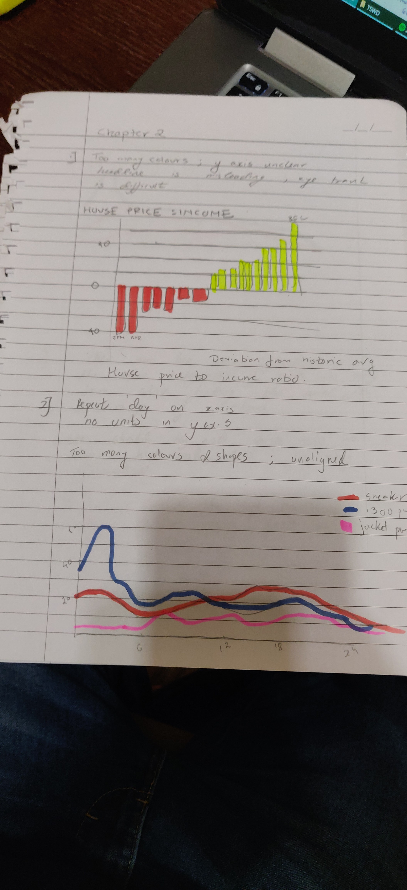
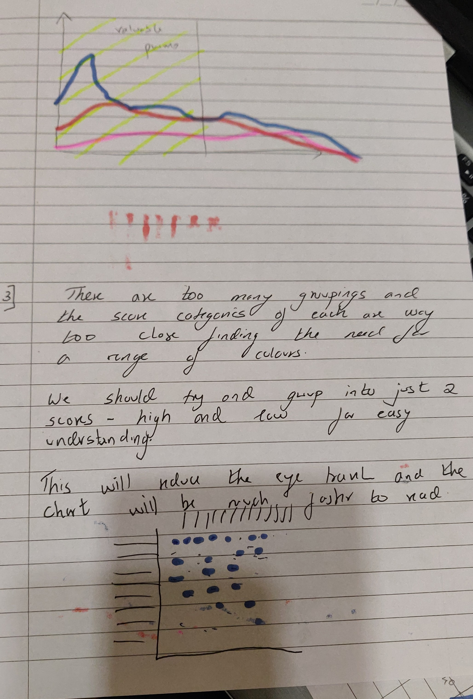

# Mukund-Nakhate
Telling Stories with Data
# About me 
My name is Dr. Mukund Nakhate from Mumbai, India and I am pursuing my masters in Healthcare Policy and Management. I am trying to bridge the gap between medical expertise and the non-clinical arms of the healthcare industry. Looking to work with problem-solving, operations, analytics, quality improvement and strategy making from the perspective of a medical professional after graduating.  

# What I hope to learn 
I hope to learn to make wireframes and dashboards for hospitals. Learn to visualise biometric data in the most understandable way. 

# Portfolio - Go on, have a scroll!

# Introduction

# Critiques of various data visualizations

## Critique 1 - The metamorphosis - Labour Party UK ( From the economist article https://www.economist.com/britain/2016/08/13/the-metamorphosis)

<iframe title="Facebook post likes" aria-label="Column Chart" src="//datawrapper.dwcdn.net/i7r9I/5/" scrolling="no" frameborder="0" style="border: none;" width="605" height="266"></iframe>

# Projects 

## Chapter one Workbook! 

# OIG Data Visualization - Source - https://www.oig.dhs.gov/sites/default/files/assets/Mga/2019/oig-19-51-jul19.pdf

## Written Summary
As a data journalist I identified that the growth in the number of apprehensions and detainees in the various CBP centers have increased drastically within a year. To convey the gross increase in the number of detainees, I used an Area chart that clearly shows the spike in the numbers from one year to the next. I segregated the various groups of detainees and gave them different colours from a colour scheme from http://colorbrewer2.org and the chart can easily be read and understood within 30 seconds. 

As an analyst I wanted to relay more information than just the gross increase. I used a percentage stacked area chart to determine which group of people are actually increasing as a percentage of the total detainees that have increased. This would allow policy makers to focus their efforts quantitatively using the data to build more centers or authorize proportional budgets to buy beds for the respective groups of the population. 

If you move your cursor to the plotted points you will notice the percentage of the total population. We can easily infer that the UAC category has reduced, family units have almost doubled and single adult population has fallen as a percentage of the total. This is vital information that the policy makers or those who read this report can utilize. 

I also added a funnel chart to show the total number of detainees, the number held for more than 3 days and the number held for more thn 10. 

I used a Guage chart to show data from texas which showed the number of detainees processed out of the total and the number of detainees that were processed but still held for more than 7 days. This chart will be helpful to analyze the backlog of detainees that ICE and other authorities cannot take in at the time. 

<a href="https://infogram.com/d5dda14a-c7e4-4627-bec8-bef4534ae288" style="color:#989898!important;text-decoration:none!important;" target="_blank">Untitled infographic</a> <a href="https://infogram.com" style="color:#989898!important;text-decoration:none!important;" target="_blank" rel="nofollow">Infogram</a>
 

# Critque #2

## India's gross domestic product growth rate

 Find more statistics at  <a href="https://www.statista.com" rel="nofollow">Statista</a>

The website uses a solid bar chart to show the GDP growth rate of India from year to year and it is redundant as it does we usually use bar charts to signify the weight off something and not to just point at one data point. 
The blue colour is too strong and hides the importance of the subtle changes in the value of GDP which hovers around the same percentage points. 

I feel that on the scale of usefulness it is not very useful, it is complete, not very perceptible. It is truthful and intutive but not aesthetic or engaging. 

# My improved data visualization  

I used a line chart to show the swings in the GDP with a better scale and a background that immediately makes a visual connection to India so the numbers are more likely to be remembered. The horizontal grid lines help with easy reading of the data and the colour is not overwhelming to the eye such we don't pay attention to the data. 

This data visualization does better on usefullness, perceptibility, aesthetics and engagement. 

<a href="https://infogram.com/ba41f8bf-6ff6-4b54-8a8d-ed6beb3be0c5" style="color:#989898!important;text-decoration:none!important;" target="_blank">Untitled report</a> <a href="https://infogram.com" style="color:#989898!important;text-decoration:none!important;" target="_blank" rel="nofollow">Infogram</a>

# Source : IMF 

# Workbook 2

# OECD Data visualization 

  [Hello](/https://github.com/mnakhate/Mukund-Nakhate/edit/master/oecdDataViz.md)
  
  
  
  

