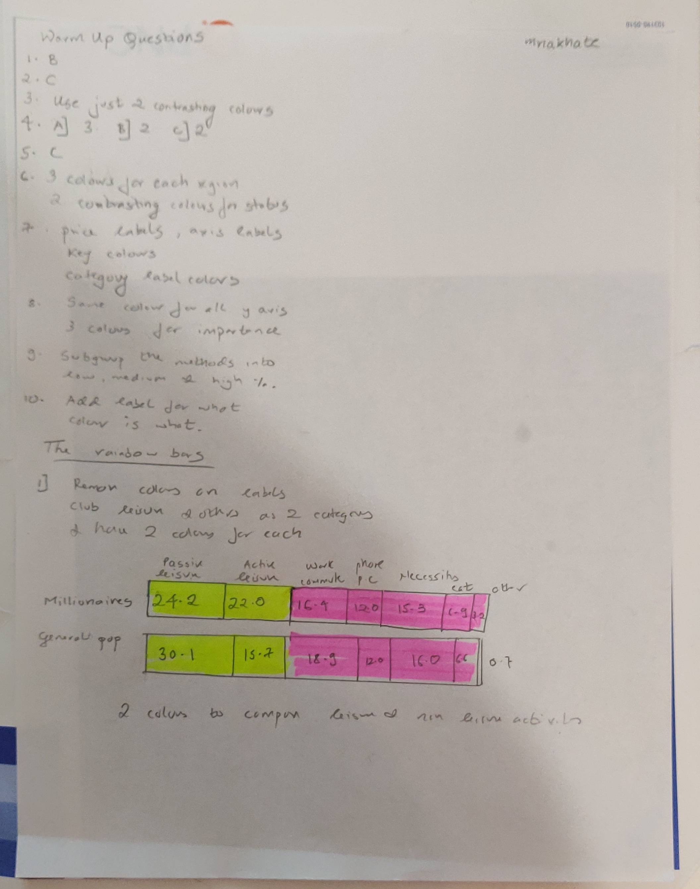
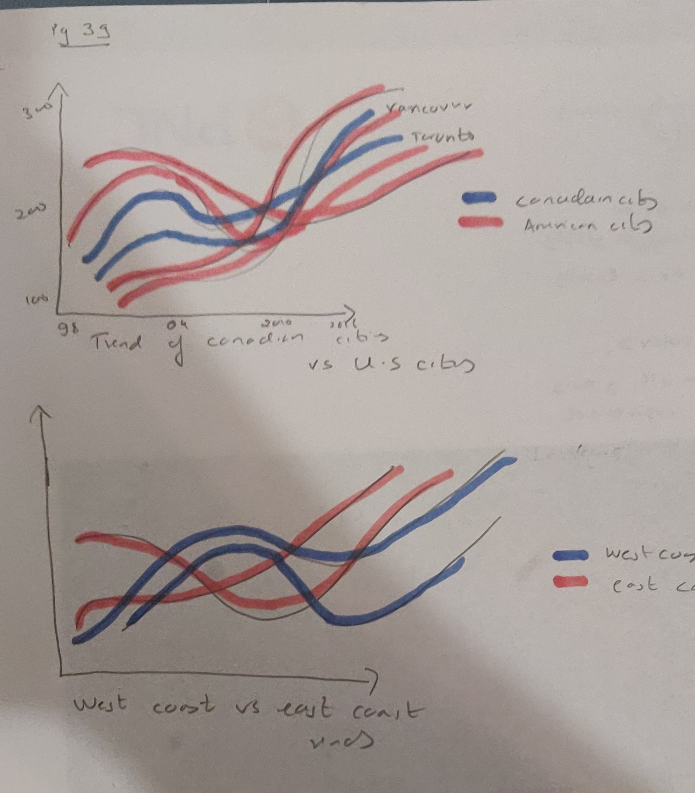

# Mukund-Nakhate
Telling Stories with Data
# About me 
My name is Dr. Mukund Nakhate from Mumbai, India and I am pursuing my masters in Healthcare Policy and Management. I am trying to bridge the gap between medical expertise and the non-clinical arms of the healthcare industry. Looking to work with problem-solving, operations, analytics, quality improvement and strategy making from the perspective of a medical professional after graduating.  

# What I hope to learn 
I hope to learn to make wireframes and dashboards for hospitals. Learn to visualise biometric data in the most understandable way. 

# Portfolio - Go on, have a scroll!

# Introduction

# Critiques of various data visualizations

## Critique 1 - The metamorphosis - Labour Party UK ( From the economist article https://www.economist.com/britain/2016/08/13/the-metamorphosis)

<iframe title="Facebook post likes" aria-label="Column Chart" src="//datawrapper.dwcdn.net/i7r9I/5/" scrolling="no" frameborder="0" style="border: none;" width="605" height="266"></iframe>

# Projects 

## Chapter one Workbook! 

# OIG Data Visualization 

<a href="https://infogram.com/d5dda14a-c7e4-4627-bec8-bef4534ae288" style="color:#989898!important;text-decoration:none!important;" target="_blank">Untitled infographic</a> <a href="https://infogram.com" style="color:#989898!important;text-decoration:none!important;" target="_blank" rel="nofollow">Infogram</a>

# Critque #2

## India's gross domestic product growth rate
 Find more statistics at  <a href="https://www.statista.com" rel="nofollow">Statista</a>

# My improved data visualization  

<a href="https://infogram.com/ba41f8bf-6ff6-4b54-8a8d-ed6beb3be0c5" style="color:#989898!important;text-decoration:none!important;" target="_blank">Untitled report</a> <a href="https://infogram.com" style="color:#989898!important;text-decoration:none!important;" target="_blank" rel="nofollow">Infogram</a>

